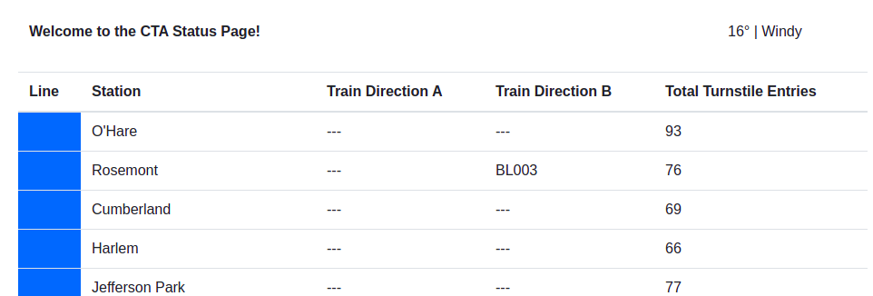
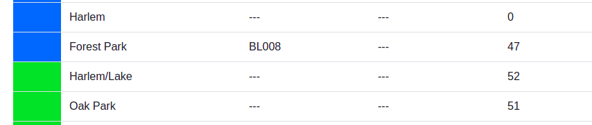
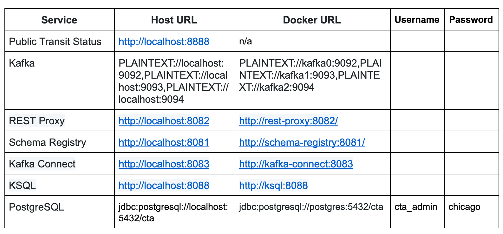

# Optimizing Public Transportation Project

The project consists of streaming public transit status using Kafka and the Kafka ecosystem to build a stream processing application that shows the status of trains in real-time.

The goal of the project is to give the possibility to monitor, throughout a website, trains move from station to station, like the image below.

# About Project

The Chicago Transit Authority (CTA) has asked to develop a dashboard displaying system status for its commuters. The choice is to use Kafka and ecosystem tools like REST Proxy and Kafka Connect to accomplish this task.

The architecture is like the image below:

# About folders and files

# Services Hosts

# About Scripts Execution

**Producer**
1. `cd producers`
2. `python simulation.py`

**Consumers**

To run the Faust Stream Processing Application:

1. `cd consumers`
2. `faust -A faust_stream worker -l info`

To run the KSQL Creation Script:

1. `cd consumers`
2. `python ksql.py`

To run the consumer

1. `cd consumers`
2. `python server.py`

**Web Page**

To see the web page just execute the command below after already had executed all commands above. The index.html will appear in the workspace.

`wget http://localhost:8889`